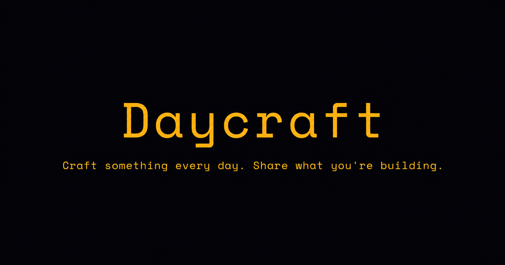

# Daycraft

> **Craft something every day. Share what you're building.**

A premium social media platform for builders — developers, designers, and creators who document their progress daily. Built as the Web3Bridge Cohort XIV Frontend JavaScript Advanced assignment.

🔗 **Live:** [daycraft-omega.vercel.app](https://daycraft-omega.vercel.app)

---

## Screenshots

| Feed | Profile | Dashboard |
|------|---------|-----------|
|  |  |  |

---

## Assignment Requirements — All Milestones Completed

| Milestone | Feature | Status |
|-----------|---------|--------|
| 1 | Register and login with authentication | ✅ |
| 2 | Users can create and delete their own posts | ✅ |
| 3 | Users can follow and unfollow other accounts | ✅ |
| 4 | Feed shows posts ONLY from followed accounts, ordered by recency | ✅ |
| 5 | Users can like and comment on any post | ✅ |
| 6 | Users can view and edit their own profile, and view others' profiles | ✅ |
| ★ | Explore page with trending posts and user search | ✅ |
| ★ | Notifications for likes, comments, follows and reposts | ✅ |
| ★ | Image upload support for posts and avatars | ✅ |

### Required React Concepts Demonstrated

- **Redux Toolkit** with `createEntityAdapter` for normalised posts and users
- **Optimistic updates** — likes, reposts and follows update the UI before the API call resolves, reverting on failure
- **`useSelector` with `createSelector`** derived selectors for filtered feed, trending posts, user's posts
- **React Router v6** for profile pages, post detail pages, protected routes
- **Custom hooks** — `useFeed`, `useLike`, `useProfile`, `useInfiniteScroll`
- **Infinite scroll** via `useEffect` + `IntersectionObserver`
- **Impression tracking** via `IntersectionObserver` — fires once per post per session at 50% visibility

---

## Tech Stack

| Layer | Technology |
|-------|------------|
| Frontend | React 18 + Vite |
| Routing | React Router v6 |
| Global state | Redux Toolkit (`createEntityAdapter`, `createSelector`) |
| Styling | Tailwind CSS v4 + CSS Variables (design tokens) |
| Animations | Framer Motion |
| Icons | Lucide React |
| Charts | Recharts |
| Backend | Supabase (PostgreSQL + Auth + Storage + Realtime) |
| Email | Brevo SMTP (signup confirmation, password reset) |
| Auth providers | Email/password + Google OAuth |
| Deploy | Vercel |

---

## Features

### Core Social
- **For You / Following feed** — global feed showing all builders, plus a filtered following-only feed
- **Post types** — Dev, Build, Workout, Read, Log — auto-detected or manually selected
- **Optimistic likes** — heart animation with particle burst, instant count update
- **Reposts** — repost other users' posts, catalogued in your Reposts tab
- **Comments** — bottom sheet on mobile, side panel on desktop
- **Infinite scroll** — loads more posts as you scroll

### Profiles
- **Cover photo** — upload custom cover, default Creator Gold gradient
- **Posts / Reposts / Liked tabs** — full content history
- **Optimistic follow** — follower count updates instantly
- **Builder badge** — earned by all registered users

### Explore
- **Trending posts** — Wilson time-decay algorithm: `(likes + comments×1.5 + reposts×2) / (hours_since_post + 2)^1.8`
- **People to Follow** — suggested users sorted by follower count
- **Live search** — debounced 300ms user search by name or @username

### Analytics Dashboard
- **Real engagement rate** — `(likes + comments + reposts) / impressions × 100` (industry standard formula)
- **Impression tracking** — IntersectionObserver fires once per post per session at 50% visibility
- **Activity chart** — Posts, Likes, Reposts per day (7d / 30d toggle)
- **Top performing posts** — ranked by total interactions

### Auth
- Email + password registration with username
- Password strength indicator (5 rules, disabled submit until all pass)
- Google OAuth
- Email confirmation via Brevo SMTP
- Forgot password / reset password flow
- Session persistence across page refresh

---

## Design System

**Palette: Builder's Dark (B×C Fusion)**

| Token | Value | Role |
|-------|-------|------|
| `--primary` | `#F59E0B` | Amber — craft, fire, creation |
| `--accent` | `#22C55E` | Green — growth, progress, shipped |
| `--accent-bright` | `#A3E635` | Lime — energy, momentum |
| `--bg` | `#0B0B0E` | Near-black background |
| `--surface` | `#1C1C24` | Card surfaces |

**Typography:** Space Mono (headings) · DM Sans (body) · JetBrains Mono (stats/code)

**Background:** Ethereal Shadow animation adapted from 21st.dev — SVG `feTurbulence` displacement filter with hue-rotate animation and inline fractal noise texture. Zero external URLs.

---

## Local Setup

```bash
# 1. Clone
git clone https://github.com/RicoKay22/daycraft.git
cd daycraft

# 2. Install
npm install

# 3. Environment variables
cp .env.local.example .env.local
# Fill in your Supabase URL and anon key

# 4. Run Supabase schema
# Open supabase-schema.sql in Supabase SQL Editor and run it

# 5. Start dev server
npm run dev
```

### Environment Variables

```
VITE_SUPABASE_URL=https://your-project.supabase.co
VITE_SUPABASE_ANON_KEY=your-anon-key
```

### Supabase Setup

1. Create a new Supabase project
2. Run `supabase-schema.sql` in the SQL Editor
3. Create a Storage bucket named `daycraft-media` (public: ON, 5MB limit)
4. Configure Brevo SMTP in Auth → Email settings
5. Add Google OAuth credentials in Auth → Providers → Google

---

## Project Structure

```
src/
├── components/
│   ├── feed/          PostCard, PostCardSkeleton, CreatePostModal, FeedEmpty, CommentSheet
│   ├── layout/        TopBar, Sidebar, BottomNav, AppLayout
│   ├── profile/       ProfileHeader, PostGrid, EditProfileModal
│   ├── notifications/ NotificationItem
│   └── ui/            LikeButton, EtherealBackground, RoundedBar, Avatar
├── context/           AuthContext, ThemeContext
├── hooks/             useFeed, useLike, useProfile, useInfiniteScroll
├── pages/             FeedPage, ExplorePage, ProfilePage, DashboardPage,
│                      NotificationsPage, PostDetailPage, AuthPage
├── store/             postsSlice, usersSlice, feedSlice, notificationsSlice
├── lib/               supabase.js
└── styles/            globals.css (design tokens)
```

---

## Developer

**Rico Kay** (Olumide Olayinka)
Web3Bridge Cohort XIV — Frontend JavaScript Advanced

- GitHub: [@RicoKay22](https://github.com/RicoKay22)
- Brand: Rico Kay · *Where Design Meets Logic*

---

*Daycraft · Web3Bridge Cohort XIV · April 2026*
